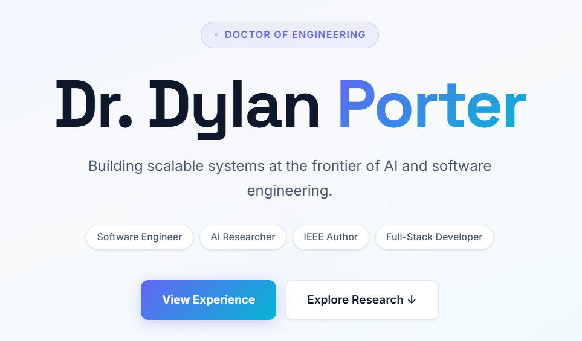
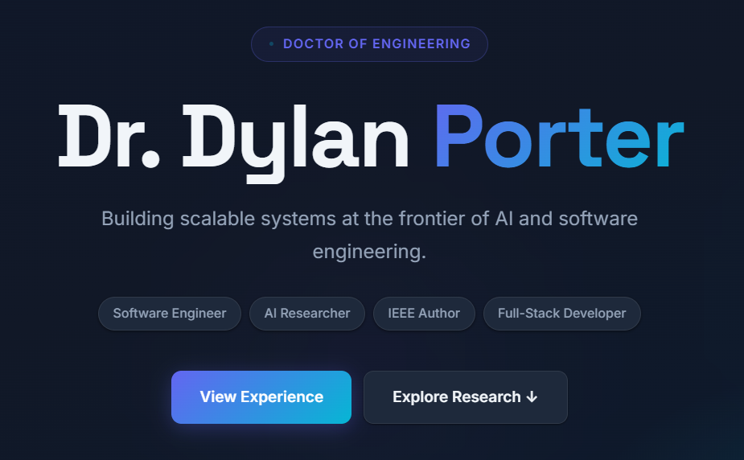

<div align="center">

# Dr. Dylan Porter — Professional Portfolio

**Software Engineer · AI Researcher · Doctor of Engineering**

[](https://developer.mozilla.org/en-US/docs/Web/HTML)
[](https://developer.mozilla.org/en-US/docs/Web/CSS)
[](https://developer.mozilla.org/en-US/docs/Web/JavaScript)
[](https://jquery.com/)
[](https://nginx.org/)
[](https://aws.amazon.com/)

---

*A clean, fast, fully static portfolio site with light/dark theme switching, scroll animations, and a live GitHub project browser.*

🌐 **Live at [drdylanporter.com](https://drdylanporter.com)**

</div>

---

## 📸 Preview

<div align="center">

| Light Mode | Dark Mode |
|:---:|:---:|
|  |  |

</div>

---

## ✨ Features

- 🌗 **Light / Dark Theme Toggle** — One-click switching with `localStorage` persistence; theme is applied before first paint to prevent flash
- 📜 **Single-Page Architecture** — About, Experience, Research, Projects, and GitHub sections on one scroll
- 🎞️ **Scroll-Reveal Animations** — Elements fade and slide in as they enter the viewport using `IntersectionObserver`
- 🔭 **Scroll-Spy Navigation** — Active nav link updates automatically as you scroll through sections
- 📑 **Tabbed Research Section** — Publications and Writing Samples toggle without a page reload
- 📊 **Live GitHub Project Table** — Full project list with search, sort, and pagination via jQuery DataTables
- 📱 **Fully Responsive** — Mobile hamburger menu, fluid grids, and clamped font sizes down to 320px
- ⚡ **Zero Build Step** — Pure HTML/CSS/JS, deploy anywhere static files are served

---

## 🗂️ Project Structure

```
ProfessionalSite/
│
├── index.html          # Main single-page portfolio
├── papers.html         # Writing samples & publications
├── resume.html         # Bootstrap-based resume (preserved legacy layout)
├── ailab.html          # AI demo lab (unlisted)
│
├── css/
│   ├── redesign.css    # Master stylesheet — design tokens, light & dark themes
│   └── site.css        # Legacy (unused)
│
├── assets/
│   ├── css/            # Bootstrap 3 (resume page only)
│   ├── js/             # Bootstrap JS + jQuery (resume page only)
│   └── plugins/        # Font Awesome, Bootstrap plugins
│
├── headerImages/       # LinkedIn, GitHub nav icons
├── ProjectImages/      # Card images (PSU, NASA, IEEE, GitHub)
├── Images/             # GitHub avatar, misc
└── Files/
    └── Papers/         # Downloadable PDFs (Praxis, IEEE, NASA, proposals)
```

---

## 🎨 Design System

All visual tokens live in `css/redesign.css` as CSS custom properties. Switching themes is a single attribute toggle on `<html>`.

| Token | Light | Dark |
|---|---|---|
| `--color-bg` | `#f8fafc` | `#0f172a` |
| `--color-bg-card` | `#ffffff` | `#1e293b` |
| `--color-text-strong` | `#0f172a` | `#f1f5f9` |
| `--color-indigo` | `#6366f1` | `#6366f1` |
| `--color-cyan` | `#0891b2` | `#0891b2` |
| `--grad-accent` | `indigo → cyan` | `indigo → cyan` |

**Fonts:** [Space Grotesk](https://fonts.google.com/specimen/Space+Grotesk) (headings) · [Inter](https://fonts.google.com/specimen/Inter) (body)

---

## 🚀 Getting Started

### Local Development

No build tools required. Just open the file:

```bash
git clone https://github.com/burghporter314/ProfessionalSite.git
cd ProfessionalSite

# Open directly in browser
open index.html        # macOS
start index.html       # Windows
xdg-open index.html    # Linux
```

Or serve locally to avoid CORS issues with any static server:

```bash
# Python
python -m http.server 8080

# Node.js
npx serve .

# VS Code
# Install the "Live Server" extension and click "Go Live"
```

### AWS / NGINX Deployment

```nginx
server {
    listen 80;
    server_name yourdomain.com;
    root /var/www/ProfessionalSite;
    index index.html;

    location / {
        try_files $uri $uri/ =404;
    }

    # Cache static assets
    location ~* \.(css|js|png|jpg|pdf|woff2)$ {
        expires 1y;
        add_header Cache-Control "public, immutable";
    }
}
```

```bash
# Copy files to server
scp -r ./ProfessionalSite ec2-user@your-server:/var/www/

# Reload NGINX
sudo nginx -s reload
```

---

## 🧩 Key Dependencies

| Library | Version | Purpose |
|---|---|---|
| [jQuery](https://jquery.com/) | 3.7.0 | DOM manipulation (DataTables requirement) |
| [jQuery DataTables](https://datatables.net/) | 1.13.7 | GitHub projects table — search, sort, paginate |
| [Bootstrap](https://getbootstrap.com/docs/3.4/) | 3.x | Resume page layout (legacy, scoped) |
| [Font Awesome](https://fontawesome.com/) | 4.x | Resume page icons (legacy, scoped) |
| [Google Fonts](https://fonts.google.com/) | — | Space Grotesk + Inter |

All dependencies are loaded from CDN — no `npm install` needed.

---

## 🌗 Theme Toggle — How It Works

The theme system uses a single `data-theme` attribute on `<html>` and CSS custom properties to swap every color at once.

```html
<!-- In <head> — runs before first paint to prevent flash -->
<script>
  try {
    if (localStorage.getItem('theme') === 'dark')
      document.documentElement.setAttribute('data-theme', 'dark');
  } catch(e) {}
</script>
```

```css
/* Light (default) */
:root { --color-bg: #f8fafc; --color-text-strong: #0f172a; }

/* Dark — activated by JS */
[data-theme="dark"] { --color-bg: #0f172a; --color-text-strong: #f1f5f9; }
```

To **reset the theme** to light on any browser:
```js
// Paste in browser console
localStorage.removeItem('theme'); location.reload();
```

---

## 📄 Pages

| Page | Path | Description |
|---|---|---|
| **Portfolio** | `/index.html` | Main single-page site with all sections |
| **Writing** | `/papers.html` | Research papers and technical proposals |
| **Resume** | `/resume.html` | Detailed resume (Bootstrap layout) |

---

## 👤 Author

<div align="center">

**Dr. Dylan Porter**
Doctor of Engineering · Penn State University

[](https://www.linkedin.com/in/dylan-p3141592/)
[](https://github.com/burghporter314)
[](https://doi.org/10.1109/MC.2024.3480629)

</div>

---

<div align="center">

&copy; 2026 Dr. Dylan Porter · Built with HTML, CSS, and JavaScript · Deployed on AWS

</div>
